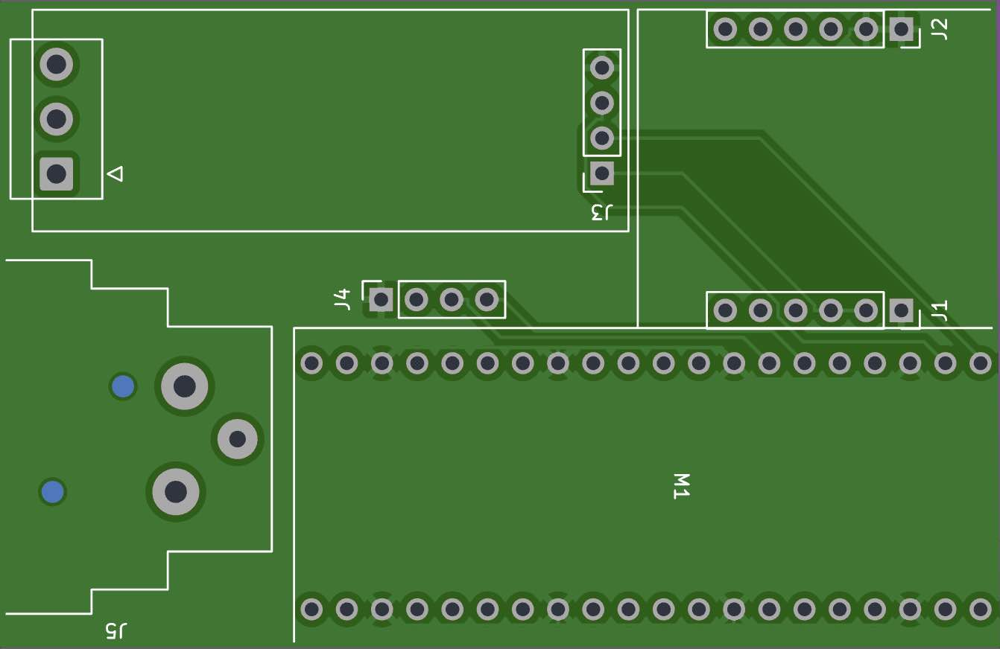

# Animatronics
## intro
In this archive you will find mostly RPI pico based projects for remote control of animatronics and theatre. 

## designs
Currently there are three physical designs:

= the [MegaAnimaltroniek](/MegaAnimaltroniek/) board is used to controls the bell's and whistles on the animaltroniek machines. Effectively it uses a design developed earlier as 'main' control board. For the animalLove robot it is equipped with a 433Mhz RF link instead of the (standard) RS485 over UTP cable
- the [picoArtnetDMX](/picoArtnetDMX/picoArtnetDMX)  unit which connects to artnet (ethernet) or WIFI and sends DMX data. This has been used in the 'Clara and the Sun' performance by the Frisian Project Orchestra.
- the [picoControl](/picoControl) module which is designed to interface with different radio modules, links to RS485/dynamixel, has two sound modules and expansion ports for Relays and / or Servos (using PCF9685) or PCF9635 (pin compatible) for Relais only. Currently in version 2 (V2.0) and the main PCB in new machines, including LUMI, Animaltroniek, animalLove and more
- the [picoServo](/picoServo) node, a very small board with RS485, -just- three input and three output ports, power supply and grove I2C socket. THis module has been used in the head (as Servo controller) of 'Clara'
- the [picoRemote](/picoRemote) contains a 4067 mux to allow 16 analog channels (joysticks, buttons, poteniometers), OLED display and radio module of choice. Currently in version 2 (V2.0) and the main source for all remotes. Typically using ELRS 2.4Ghz transmitter, but APC220 can be used as fallback. Also pinout for NRF24L01 is available
- the [picoMiniMIDIcontrol](/picoMiniMIDIcontrol/) uses a grove 8-knob module and a pico to act as a very basic USB-midi control panel. It has been used as complementary input device for the picoRemote device. Small side-project showing MIDI device code. It has been used as small MIDI panel for the remote designed for 'Clara'
- the [picoMIDInode](/picoMIDInode/) uses the picoServo board as USB-MIDI host (with a USB-A socket wired to the 'servo' output pins) and acts as USB-MIDI device

## setting up
The development environment consists of Visual Studio Code with PlatformIO. Further libraries are installed through the the platformIO library manager.

The BetaFPV transmitter and receivers used require the ExpressLRS configurator to be available. Typically the modules are flashed (updated) using the available WIFI method. 