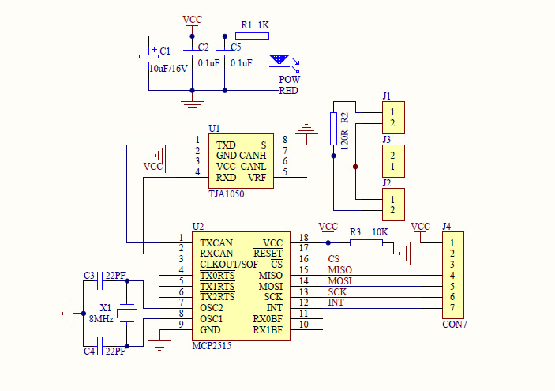

# Animatronics
## intro
In this archive you will find RPI pico based projects for remote control of animatronics and theatre. 

## designs
Currently there are three physical designs:

- the [MegaAnimaltroniek](/MegaAnimaltroniek/) board is used to controls the bell's and whistles on the animaltroniek machines. Effectively it uses a design developed earlier as 'main' control board. For the animalLove robot it is equipped with a 433Mhz RF link instead of the (standard) RS485 over UTP cable
- the [picoArtnetDMX](/picoArtnetDMX/picoArtnetDMX)  unit which connects to artnet (ethernet) or WIFI and sends DMX data. This has been used in the 'Clara and the Sun' performance by the Frisian Project Orchestra.

- the [picoControl](/picoControl) module which is designed to interface with different radio modules, links to RS485/dynamixel, has two sound modules and expansion ports for Relays and / or Servos (using PCF9685) or PCF9635 (pin compatible) for Relais only. Currently in version 2 (V2.0) and the main PCB in new machines, including LUMI, Animaltroniek, animalLove and more
- the [picoServo](/picoServo) node, a very small board with RS485, -just- three input and three output ports, power supply and grove I2C socket. THis module has been used in the head (as Servo controller) of 'Clara'
- the [picoRemote](/picoRemote) contains a 4067 mux to allow 16 analog channels (joysticks, buttons, poteniometers), OLED display and radio module of choice. Currently in version 2 (V2.0) and the main source for all remotes. Typically using ELRS 2.4Ghz transmitter, but APC220 can be used as fallback. Also pinout for NRF24L01 is available
- the [picoMiniMIDIcontrol](/picoMiniMIDIcontrol/) uses a grove 8-knob module and a pico to act as a very basic USB-midi control panel. It has been used as complementary input device for the picoRemote device. Small side-project showing MIDI device code. It has been used as small MIDI panel for the remote designed for 'Clara'
- the [picoMIDInode](/picoMIDInode/) uses the picoServo board as USB-MIDI host (with a USB-A socket wired to the 'servo' output pins) and acts as USB-MIDI device

## setting up
The development environment consists of Visual Studio Code with PlatformIO. Further libraries are installed through the the platformIO library manager.

The BetaFPV transmitter and receivers used require the ExpressLRS configurator to be available. Typically the modules are flashed (updated) using the available WIFI method. 

## actuators
A large number of different actuators have been used in the system, most of them are currently included in the picoControl module
### waveshare 3215 servo
This servo is used in the desklight arm

### waveshare D210s wheel
This wheel is currently not yet used, 

### generic H-Bridges for DC and BLDC
Most of the H-bridges can be controlled with a number (usually 3 or 4) signals. Typically they include two bits for direction/braking/coasting, a PWM bit and occasionally a separate brake relay. 

Bridges that have been used / tested are:
- pololu [High Ppower Motor Driver 36v20 CS](https://www.pololu.com/product/1457) used for Alan, Helper
- electromen [EM-243C](https://electromen.com/en/motor-controllers/dc-motor-controllers-over-a/em-c-dc-motor-controller-1) - configured with [EM-236A](https://electromen.com/en/supportive-products/electronics/em-a-interface-unit) tool, used for Animaltroniek and AnimalLove.
- electromen [EM-206 BLDC motor](https://electromen.com/en/motor-controllers/brushless-dc-motor-controllers/em-brushless-controller) used for Ravi
- DFRobot 0601 [Dual Channel DC Motor Driver 12A](https://wiki.dfrobot.com/Dual_Channel_DC_Motor_Driver_12A_SKU_DFR0601) to be used for the vacuum cleaner .. 

### cubemars AK60
This is a complex motor unit requiring can-bus. The motor is using a [MCP2515](https://www.tinytronics.nl/en/communication-and-signals/serial/can-bus/mcp2515-can-bus-transceiver-module) module on pins 16,18 and 19, with CS on 17 for SPI0 or 10 (SCK) 11 (MOSI) 12 (MISO) for SPI1 (currently used on the V1.0 board). note that the MCP2515 needs 3.3V but the signal driver 5.0V on a non-joyit module this means cutting the supply line and adding a wire for 5V. 

Configuration software is necessary, but only available for Windows (so a separate tiny windows computer has been acquired to run just the config tool) An FTDI-USB-serial 3.3V edition cable is used to connect the AK60 to the windows PC. Using this tool a motor Address has been set (104) and communication mode. 

### Dynamixel X430 series
like the 'old' MX-64, MX-28 and others, this protocol (dynamixel) is included through the official Robotis library through github (in the platformio.ino: `robotis-git/Dynamixel2Arduino@^0.8.1`)