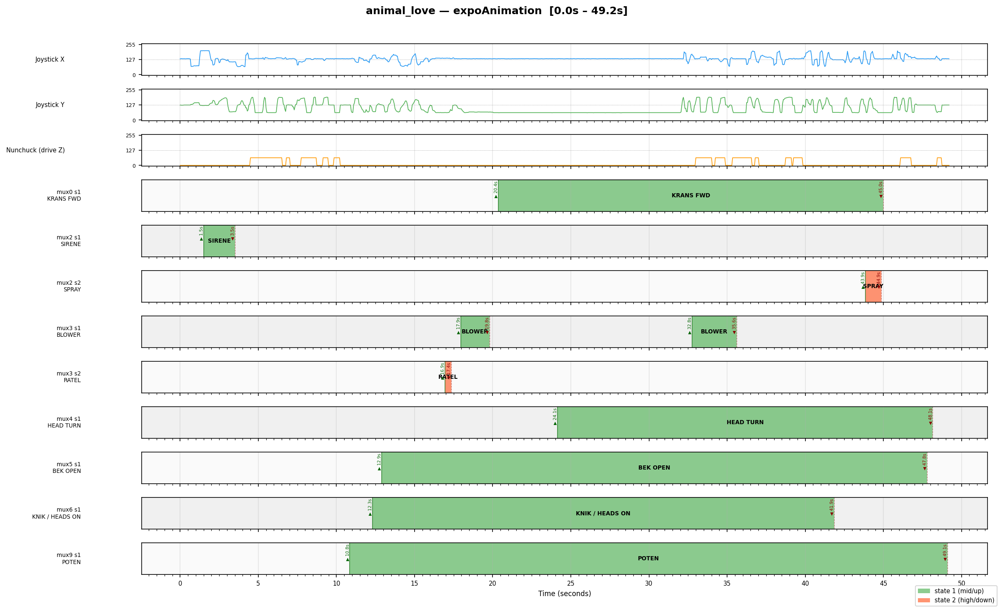

# picoControl — Animatronic Robot Control Firmware

RP2040-based receiver firmware for controlling animatronic vehicles via ELRS/CRSF radio.
Built with PlatformIO + EarlPhilhower Arduino core.

---

## Building

```bash
pio run -e animaltroniek_vis    # build one vehicle
pio run                         # build all vehicles (catches regressions)
pio run -e animaltroniek_vis -t upload
```

### Environments

| Environment | Vehicle | Audio | Notes |
|---|---|---|---|
| `animaltroniek_vis` | Fish | none | RS485 passthrough, recorded animation |
| `animaltroniek_kreeft` | Crab | none | RS485 passthrough, recorded animation |
| `animaltroniek_schildpad` | Turtle | none | RS485 passthrough (empty track) |
| `animal_love` | Animal Love | none | RS485 passthrough + expo animation |
| `scuba` | SCUBA diver | 1 player | Jaws sequence, bubble background |
| `ami` | AMI animatronic car | 2 players | Looking sequence, RS485 eyes |
| `lumi` | LUMI light robot | 2 players | Track + sample audio |
| `washmachine` | Washing machine | none | M5 servos, trommel motor |

---

## Hardware

### Board Versions

#### V1 — PCA9685 (PWM LED driver)
- I2C address: `0x40`
- 16-channel PWM output used as relay driver
- `BOARD_V1` in `config.h` → `USE_9685` in `PicoRelay.h`
- Output polarity: `setPWM(n, 0, 4095)` = HIGH = relay OFF; `setPWM(n, 0, 0)` = LOW = relay ON
- **Limitation:** on power-up all outputs default to LOW, briefly activating all relays. Cannot be prevented in software — happens before the RP2040 starts. This was the primary motivation for the V2 board.
- Library: Adafruit PWM Servo Driver

#### V2 — PCA9635 (LED driver)
- I2C address: `0x70` (default; depends on A0-A5 pin configuration on the board)
- 16-channel **open-drain** output
- `BOARD_V2` in `config.h` → `USE_9635` in `PicoRelay.h`
- Output polarity: `PCA963X_LEDON` (01) = output sinks LOW = relay ON; `PCA963X_LEDOFF` (00) = floating/HIGH = relay OFF
- **Advantage:** power-on default is high-impedance — relays stay off at startup
- Must call `setLedDriverMode()` on all 16 channels after `begin()`, otherwise subsequent writes are silently ignored
- Library: robtillaart/PCA9635 v0.6

#### EXTRA_RELAY — 8 additional GPIO relays
Enabled by `EXTRA_RELAY` in `config.h`. Relay numbers 16-23 map to GPIO pins:

| Relay | GPIO |
|---|---|
| 16 | 18 |
| 17 | 19 |
| 18 | 20 |
| 19 | 21 |
| 20 | 22 |
| 21 | 26 |
| 22 | 27 |
| 23 | 28 |

All GPIO relays are low-active: `LOW` = ON, `HIGH` = OFF. Initialised HIGH at startup.

#### Board Version Selection — Critical Rule
`BOARD_Vx` **must** be defined before `#include "Action.h"` in `config.h`, because `Action.h` includes `PicoRelay.h` which uses `BOARD_Vx` to select the chip. It is set once in an early `#if defined(...)` block at the top of `config.h`. For SCUBA/AMI (which can use either board), there is a dedicated section:

```cpp
#if defined(SCUBA) || defined(AMI)
#define BOARD_V2 (1)   // V2 board (PCA9635)
//#define BOARD_V1 (1) // V1 board (PCA9685)
#endif
```

**Never** define `BOARD_Vx` inside a vehicle's own `#ifdef` block — duplicate defines cause the wrong chip to be selected.

### Audio Players
- **Player 1:** DFRobot DF1201S — SoftwareSerial GP6 (RX) / GP7 (TX)
- **Player 2:** DFRobot DF1201S — SoftwareSerial GP16 (RX) / GP17 (TX)
- Initialised on Core 0 in `platformSetup()` with a 5-attempt timeout (2.5s max per player)
- Play/pause commands queued via `AudioQueue` (mutex-protected ring buffer), drained on Core 0 in `platformLoop()`

### RS485
- Hardware UART1, direction controlled via `RS485_SR` pin
- `RS485WriteBuf()` includes `delayMicroseconds(500)` after each packet as an inter-packet gap
- `BUFFER_PASSTHROUGH 9` vehicles send a 9-byte legacy-format buffer every 20Hz tick

---

## Architecture

### Dual-core split

| Core 0 (20 Hz gate) | Core 1 (free-running) |
|---|---|
| Read `channels[]` from Core 1 | CRSF receive + parse |
| Update Actions and Sequences | Map 0-255 per channel |
| RS485 / motor / servo output | Link stats (RSSI, LQ) |
| OLED display | (nothing else — ever) |
| Animation playback | |
| Audio drain + background | |

**Core 1 runs CRSF and nothing else.** `platformSetup1()` and `platformLoopCore1()` are empty for all vehicles. Audio SoftwareSerial calls must never run on Core 1 — they are blocking and halt CRSF reception.

Cores share data via RP2040 SDK mutexes (`pico/mutex.h`).

### Startup sequence
1. Core 0 `setup()` initialises all hardware including `audioInit()` (blocking, up to 2.5s per player)
2. Core 0 sets `_core0SetupDone = true` at the very end of `setup()`
3. Core 1 `setup1()` spins on `_core0SetupDone`, then starts `crsfCore1Setup()`
4. Both cores enter their loops

### Channel protocol — `include/crsf_channels.h`

All 16 channels arrive as 0-255 (mapped from CRSF 172-1811).
**This file must be identical on transmitter and receiver.**

```
channels[0]  CRSF_CH_AXIS_X1        Primary X axis (127=centre)
channels[1]  CRSF_CH_AXIS_Y1        Primary Y axis
channels[2]  CRSF_CH_AXIS_X2        Secondary X (127 if unused)
channels[3]  CRSF_CH_AXIS_Y2        Secondary Y
channels[4]  CRSF_CH_ARM            0=disarmed, 255=armed
channels[5]  CRSF_CH_ANALOG1        Volume/speed pot (0-255)
channels[6]  CRSF_CH_ANALOG2        Spare analog
channels[7]  CRSF_CH_ANALOG3        Spare analog
channels[8]  CRSF_CH_NUNCHUCK_BTN   0=none, 64=Z, 128=C, 192=both
channels[9]  CRSF_CH_KEYPAD_LO      Keypad bits 0-7
channels[10] CRSF_CH_KEYPAD_HI      Keypad bits 8-11
channels[11] CRSF_CH_SW_MUX_0_3     Switch bank A (mux ch 0-3, 2 bits each)
channels[12] CRSF_CH_SW_MUX_4_7     Switch bank B (mux ch 4-7)
channels[13] CRSF_CH_SW_MUX_8_11    Switch bank C (mux ch 8-11)
channels[14] CRSF_CH_SW_MUX_12_15   Switch bank D (mux ch 12-15)
channels[15] CRSF_CH_SPARE          Always 127
```

Switch state per mux channel: `SWITCH_HIGH(sw,n)` (state==2), `SWITCH_MID(sw,n)` (state==1), `SWITCH_LOW(sw,n)` (state==0).
Keypad: `KEYPAD_PRESSED(lo, hi, KEY_BIT_5)` etc.
Nunchuck: `NUNCHUCK_C(channels)` = C pressed (128), `NUNCHUCK_Z(channels)` = Z pressed (64), `NUNCHUCK_BOTH` = both (192).

---

## Action system

```cpp
Action(SW(n,2), relaynr, mode)                               // mux ch n HIGH -> relay
Action(SW(n,1), relaynr, mode)                               // mux ch n MID -> relay
Action(SW(n,0), relaynr, mode)                               // mux ch n LOW -> relay
Action(KEY_ACTION(KEY_BIT_5), relaynr, mode, ..., track, &player1)  // keypad -> audio
Action(-1, relaynr, TRIGGER)                                 // internal/sequence-driven only
```

**Button encoding:**

| Value | Meaning |
|---|---|
| `SW(n, 2)` = n (0-15) | Mux channel n, state HIGH |
| `SW(n, 1)` = 50+n | Mux channel n, state MID |
| `SW(n, 0)` = 30+n | Mux channel n, state LOW |
| `KEY_ACTION(KEY_BIT_x)` = 100+bit | Keypad key |
| `-1` | Never fires from remote |

**Modes:** `DIRECT` (held), `TOGGLE` (press/press), `TRIGGER` (one-shot, no auto-stop from `update()`)

**Important:** actions driven by sequences must use `button=-1` and `TRIGGER` mode. A `DIRECT` action triggered by a sequence is immediately stopped by `update()` on the next tick because the button is not physically held.

---

## Animation system

### `animationStep` struct (`include/Animation.h`)

9 bytes per step recorded at 20 Hz:

```cpp
typedef struct {
  uint8_t axis_x;       // CRSF_CH_AXIS_X1
  uint8_t axis_y;       // CRSF_CH_AXIS_Y1
  uint8_t nunchuck;     // CRSF_CH_NUNCHUCK_BTN (0/64/128/192)
  uint8_t keypad_lo;    // CRSF_CH_KEYPAD_LO (bits 0-7)
  uint8_t analog1;      // CRSF_CH_ANALOG1 (volume/speed)
  uint8_t sw_mux_0_3;   // CRSF_CH_SW_MUX_0_3
  uint8_t sw_mux_4_7;   // CRSF_CH_SW_MUX_4_7
  uint8_t sw_mux_8_11;  // CRSF_CH_SW_MUX_8_11
  uint8_t sw_mux_12_15; // CRSF_CH_SW_MUX_12_15
} animationStep;
```

Binary layout is identical to the original struct — all existing `Track-xxx.h` files work without modification.

### Embedding actuator commands in a track
Switch bank fields encode 4 mux channels x 2 bits each. To activate mux channel N during playback, add the appropriate value to the relevant field. Example [animal_love]: mux ch 2 MID (`SW(2,1)`) in `sw_mux_0_3` (field 5) = add `16`. This allows actuators (sirens, motors, etc.) to be embedded in recorded tracks without a separate sequence.

### Recording a new animation
1. Uncomment `#define ANIMATION_DEBUG` in `config.h` for your vehicle
2. Flash and open serial monitor
3. Move controls — each 20 Hz tick prints one line:
   `{axis_x,axis_y,nunchuck,keypad_lo,analog1,sw0-3,sw4-7,sw8-11,sw12-15},`
4. Copy output, paste as the array body in `Track-xxx.h`
5. Set `DEFAULT_STEPS` to the number of lines
6. Comment out `ANIMATION_DEBUG`, rebuild

### Animation trigger
`ANIMATION_KEY` in `config.h` is the mux channel number. `ANIMATION_KEY_STATE` (0/1/2, default 2) sets which switch state triggers playback:

```cpp
#define ANIMATION_KEY        12   // mux channel
#define ANIMATION_KEY_STATE   2   // HIGH = SW(12,2)
```

The `ANIMATION_KEY_PRESSED` macro in `main.cpp` resolves to the correct `getRemoteSwitch*()` call. The animation key channel is always updated from live CRSF data during playback so releasing the switch correctly stops the animation.

---

## Debug flags

All flags are commented out by default and compiled away when inactive:

| Flag | Effect |
|---|---|
| `ANIMATION_DEBUG` | Prints channel values at 20 Hz for animation recording |
| `ANIMATION_KEY_DEBUG` | Dumps switch banks and animation key state every 1s |
| `RS485_DEBUG` | Mirrors RS485 TX buffer to serial every 1s |
| `RELAY_DEBUG` | Prints `RELAY ON/OFF: n` on every relay state change |
| `RELAY_TEST` | Enables `t` (flash all relays) and `r` (I2C scan) serial commands |
| `AUDIO_DEBUG` | Prints `AUDIO P1/P2 PLAY/PAUSE track=n` |
| `INPUT_DEBUG` | Prints all switch states, keypad bits, and nunchuck value every 500ms |

---

## Per-vehicle config (`include/config.h`)

Key flags:

| Flag | Effect |
|---|---|
| `USE_AUDIO 1/2` | Enable 1 or 2 DFRobot audio players |
| `USE_MOTOR` | Enable DC motor control |
| `USE_RS485` | Enable RS485 output |
| `BUFFER_PASSTHROUGH 9` | Send 9-byte legacy RS485 buffer each tick |
| `USE_OLED` | Enable 128x32 OLED display |
| `USE_CRSF` | Enable ELRS/CRSF radio (Core 1) |
| `USE_SPEEDSCALING` | Enable nunchuck-based speed scaling for motors |
| `ANIMATION_KEY n` | Mux channel number for animation trigger |
| `ANIMATION_KEY_STATE n` | Switch state (0/1/2) that triggers animation |
| `ANIMATION_TRACK_H` | Track file to include (e.g. `"Track-vis.h"`) |
| `BACKGROUND_TRACK_1` | Track number for auto-restarting background audio on player 1 |
| `EXTRA_RELAY` | Enable 8 additional GPIO relay channels (16-23) |
| `EXPO_KEY` | GPIO pin for expo animation trigger (INPUT_PULLUP) |

---

## CRSF link / RSSI

CRSF runs on Core 1, completely isolated from Core 0.
`core1_crsf.cpp` parses both `0x16` (RC channels) and `0x14` (link statistics) frames.

Link statistics via `crsfGetLinkStats(CrsfLinkStats& out)`:
- `rssi_ant1` — uplink RSSI in dBm (signed, e.g. -64)
- `link_quality` — uplink LQ 0-100%
- `downlink_rssi` / `downlink_lq` — nanoRX to TX module link

On RF loss (>500ms): mode to IDLE, `channels[]` reset to `saveValues`.
Serial: `CRSF: LOST` > `CRSF RESTART #N` (exponential backoff) > `CRSF: ACTIVE (recovered)`.

---

## OLED display (128x32)

```
x=0   Vehicle name (3 chars)   SCU / AMI / LUM / KRE / VIS / SCH / LOV / WAS
x=20  Mode                      "act" or "idle"
x=44  Sequence/platform status  "sq:4s" when animation playing, platformScreen() otherwise
x=86  Link quality              "LQ:100%"

Middle: J1 joystick | nunchuck C/Z dots | J2 joystick | 4x4 switch grid | 3x4 keypad | signal bars + dBm
Bottom: Volume bar
```

---

## RS485 passthrough (animaltroniek / animal_love vehicles)

`BUFFER_PASSTHROUGH 9` — 9 bytes sent every 20Hz:

```
[0] axis_x
[1] axis_y
[2] nunchuck raw (0=none, 64=Z, 128=C, 192=both)
[3] keypad ASCII char (first pressed key, 0=none)
[4] volume (analog1)
[5] sw_mux_0_3
[6] sw_mux_4_7
[7] sw_mux_8_11
[8] sw_mux_12_15
```

During animation playback, values come from the track file rather than live RF.

---

## Adding a new vehicle

1. **`platformio.ini`** — add `[env:myvehicle]` with `-DMYVEHICLE`
2. **`config.h`** — add `#ifdef MYVEHICLE` block. Board version in early block only.
3. **`src/platform_myvehicle.cpp`** — implement the 6 platform functions:

```cpp
void platformSetup();       // Core 0: init, audioInit(), configureSequences()
void platformLoop();        // Core 0: sequences, drainAudioQueue(), RS485
void platformScreen();      // Core 0: text for x=44 on OLED top row
void platformOnIdle();      // Core 0: called when RF link lost
void platformSetup1();      // Core 1: leave empty
void platformLoopCore1();   // Core 1: leave empty
```

---

## Vehicle status

| Vehicle | Status | Notes |
|---|---|---|
| animaltroniek_vis | working | Animation, RS485, switches, nunchuck confirmed |
| animaltroniek_kreeft | compile | Same hardware as vis |
| animaltroniek_schildpad | compile | Empty track |
| animal_love | working | Animation, expo sequence, siren, motors confirmed |
| scuba | working | Jaws sequence, audio, relays, snorkel confirmed |
| ami | working | Looking sequence, audio, 24 relays, RS485 eyes confirmed |
| lumi | compile | Untested with new transmitter |
| washmachine | compile | Untested with new transmitter |

---

## Track visualisation tool

The `tools/` directory contains a Python visualiser for inspecting and verifying animation tracks before flashing.

### Setup

```bash
pip install matplotlib pyyaml
```

### Usage

Run from the project root:

```bash
# View interactively (example for animal_love)
python3 tools/track_visualiser.py src/Track-animalove.h tools/channel_map_animal_love.yaml --animation expo

# Save to PNG (place output in docs/ for documentation)
python3 tools/track_visualiser.py src/Track-animalove.h tools/channel_map_animal_love.yaml --animation expo --output docs/expo_track.png
python3 tools/track_visualiser.py src/Track-animalove.h tools/channel_map_animal_love.yaml --animation default --output docs/default_track.png

# Zoom into a section — arguments are step numbers (20 steps = 1 second)
python3 tools/track_visualiser.py src/Track-animalove.h tools/channel_map_animal_love.yaml --animation expo --start 0 --end 400
```

### Output images

Place generated PNG files in `docs/` for reference:

```
docs/
  expo_track.png      — full expo animation timeline
  default_track.png   — full default animation timeline
```

**Example output — animal_love expo animation:**



Each actuator gets its own row. States that share a mux channel (e.g. [animal_love] siren=state1 and spray=state2 on mux2) are always shown on separate rows so they never overlap visually. Start and stop times are annotated at each transition edge.

### Channel map file (`tools/channel_map.yaml`)

The YAML file maps mux channel numbers and states to human-readable labels. Edit it to add or rename actuators without touching the Python script. Only channels with non-zero activity in the selected range are shown.

```yaml
# Example from tools/channel_map_animal_love.yaml
switches:
  - mux: 2
    label: "Sirene / Spray"   # animal_love: mux2 controls both siren and spray
    states:
      1: "SIRENE"    # SW(2,1) — bottom board relay7
      2: "SPRAY"     # SW(2,2) — top board relay0
```

### Switch encoding — debug output vs track data [animal_love example]

The `INPUT_DEBUG` serial output prints:
```
SW[0-3]: 0=0 1=0 2=1 3=0 4=0 5=1 ...
```
where the number before `=` is the **mux channel** (0-15) and the value after is the **state** (0=off/centre, 1=mid, 2=high). So `2=1` means mux channel 2, state 1 = `SW(2,1)`. In animal_love this is the siren.

In the `animationStep` struct, mux channel N is packed into field `5 + N/4` at bit position `2*(N%4)`. The 2-bit state value sits in those bits: `0b01`=state1, `0b10`=state2. So:

| Debug output | Mux ch | Field | Bits | Field value |
|---|---|---|---|---|
| `SW(2,1)` [animal_love: siren] | 2 | field5 | 4-5 | 16 (0b00010000) |
| `SW(2,2)` [animal_love: spray] | 2 | field5 | 4-5 | 32 (0b00100000) |
| `SW(6,1)` [animal_love: heads] | 6 | field6 | 4-5 | 16 |
| `SW(5,1)` [animal_love: beak] | 5 | field6 | 2-3 | 4  |

Values combine when multiple channels are active: field5=48 means siren(16) + spray(32) both on simultaneously.

---

## Animal Love — dual RS485 board mapping

Animal Love has two RS485 receiver boards that both receive the same 9-byte passthrough buffer.

### Top board (raw bitmask decoding)

The top board's `getRemoteSwitch(button)` reads bit `button % 8` from the corresponding packed switch byte. Since our encoding puts 2 bits per mux channel, each individual bit fires a relay independently:

| Action | Button | Bit of field | Mux ch | State | Actuator |
|---|---|---|---|---|---|
| Action(5,  relay0) | 5 | bit5 of field5 | mux2 | state2 | water/spray |
| Action(6,  relay1) | 6 | bit6 of field5 | mux3 | state1 | blaas/blower |
| Action(8,  relay2) | 8 | bit0 of field6 | mux4 | state1 | L+R head turn |
| Action(10, relay3) | 10 | bit2 of field6 | mux5 | state1 | bek/beak |
| Action(12, relay4) | 12 | bit4 of field6 | mux6 | state1 | knik/heads |
| Action('6'–'8', relay5–7) | keypad | — | — | — | keypad only |

### Bottom board (SW notation decoding)

| Action | Switch | Actuator |
|---|---|---|
| SW(0,1) | mux0 state1 | tandkrans forward |
| SW(0,2) | mux0 state2 | tandkrans reverse |
| SW(1,1) | mux1 state1 | lift mid |
| SW(1,2) | mux1 state2 | lift up |
| SW(2,1) | mux2 state1 | sirene |
| SW(2,2) | mux2 state2 | spray (also fires top board relay0) |
| SW(3,2) | mux3 state2 | ratel |
| SW(9,1) | mux9 state1 | poten |

---

## Stofzuiger (vacuum cleaner) — platform notes

### Hardware

| Component | Detail |
|---|---|
| Drive motors | 2× Electromen H-bridge (board 3.5), sign/magnitude PWM |
| Motor pins | motorLeft: 21, 22, 26 — motorRight: 18, 19, 20 |
| DDSM210 | Direct drive hub motor, SoftwareSerial GP14 (TX) / GP15 (RX), 115200 baud |
| Mouth servo | M5Unit8Servos board (I2C 0x25), channel 0, 1000–1500µs |
| Controller | BetaFPV (no nunchuck) |

### Channel mapping

| Channel | Axis | Function |
|---|---|---|
| `channels[0]` AXIS_X1 | Right stick X | Drive left/right (cross-mix) |
| `channels[1]` AXIS_Y1 | Right stick Y | Drive forward/back (cross-mix) |
| `channels[2]` AXIS_X2 | Left stick X | Mouth servo (1000–1500µs) |
| `channels[3]` AXIS_Y2 | Left stick Y | DDSM210 spin speed |

### DDSM210 specifics

The DDSM210 is a FOC-controlled PMSM hub motor. Key notes:

- **No free-float via UART** — the motor always applies active control when powered. True free rotation is only possible when unpowered. Mode 0 (open loop) with cmd=0 gives minimal holding torque but is not a true coast.
- **Speed loop mode (mode 2)** is used throughout. Mode is re-asserted every 5 seconds in `platformLoop()` as a watchdog against startup corruption.
- **Shocks on speed change** are inherent to the FOC controller applying full current to reach commanded RPM instantly. Move the stick gradually to avoid them — no software ramping is applied (it was found to reduce responsiveness without solving the shock).
- **DDSM owned by platform file** — `dc` and `DDSMport` are declared in `platform_stofzuiger.cpp`, not in `main.cpp`. The `!defined(STOFZUIGER)` guard in `main.cpp` prevents double-declaration.

### Config.h flags for STOFZUIGER

```cpp
#define USE_MOTOR (1)
#define USE_CROSS_MIXING (1)
// No USE_SPEEDSCALING — BetaFPV, no nunchuck
#define MAX_SPEED 255
#define BRAKE_TIMEOUT 30
#define USE_M5_SERVOS (1)
#define USE_OLED (1)
#define USE_CRSF (1)
#define NUM_CHANNELS 16
extern const int saveValues[];   // defined in platform_stofzuiger.cpp
```

### Startup sequence

`platformSetup()` runs after `main.cpp` has initialised OLED and M5 servos. DDSM init:
1. `delay(200)` — lets DDSM settle after power-up
2. Mode + zero command sent 3× with 20ms gaps — handles corrupted first packet
3. Buffer cleared

This was necessary because the DDSM startup is unreliable when the RP2040 boots fast — USB serial init at 115200 baud can cause GPIO noise that corrupts the first UART packet.

### Omniwheel / washmachine note

The `mode == ACTIVE` gate added to the `#else` (non-speedscaling) motor path in `main.cpp` only affects STOFZUIGER. All other vehicles using `USE_MOTOR` also define `USE_SPEEDSCALING` and take the `#ifdef` branch which is unchanged.

### Stofzuiger — updates and corrections

**Mouth servo safe state** — `saveValues[2]` (AXIS_X2) is set to `0`, which maps to 1150µs (closed) via `map(0, 0, 255, 1150, 800)`. On RF link loss the servo automatically holds closed through the normal write path — no special detach logic needed.

**Mouth servo range** — `map(channels[2], 0, 255, 1150, 800)`:
- Stick low (0) → 1150µs → closed (safe default)
- Stick high (255) → 800µs → fully open

**DDSM ID** — the DDSM210 stores its motor ID in flash. Factory default is ID 1. This codebase uses `DDSM_ID 4`. If a replacement motor does not respond, check its ID using `ddsm_id_check()` and either update `DDSM_ID` in the platform file or reprogram the motor with `ddsm_change_id(4)`.

**Pico W LED** — stofzuiger uses a Pico W. The onboard LED is routed through the CYW43 WiFi chip, not GPIO 25. Set `board = rpipicow` in `platformio.ini` for the stofzuiger env so the EarlPhilhower core correctly routes `LED_BUILTIN` through the CYW43 driver. No WiFi stack initialisation needed — just the board definition.

**Servo detach on link loss** — multiple approaches were tried (`crsfReady()`, `crsfLost()`, a `servoAttached` flag) but all failed because `platformLoop()` runs every tick unconditionally and re-attaches the servo immediately after `platformOnIdle()` detaches it. The clean solution is `saveValues[2] = 0` so the servo naturally returns to closed on link loss without needing detach logic.

---

## DDSM210 free-spin mode — MOSFET power cut [stofzuiger, experimental]

After extensive investigation, the DDSM210 has no true free-spin/coast mode accessible via UART. All software modes (speed loop at 0, open loop cmd=0, position loop) apply active FOC control. Open loop cmd=0 is actually worse than speed loop — it shorts the windings causing regenerative braking.

The solution is a hardware MOSFET on GPIO11 that cuts power to the DDSM entirely. With power cut, the motor spins freely. An N-channel MOSFET is used: GPIO HIGH = motor powered, GPIO LOW = power cut.

### SA switch mode selection

SA (channels[4], 3=off/252=on) selects deadband behaviour:
- **SA off (default)** — free-spin: GPIO11 LOW, TX pin released (INPUT), motor coasts
- **SA on** — lock: speed loop at 0 rpm, motor holds position

### Non-blocking boot sequence

When leaving the deadband after power cut:
1. GPIO11 HIGH — power restored
2. `DDSMport.begin(115200)` — SoftwareSerial re-initialised
3. 80ms non-blocking wait (millis-based) — DDSM boots
4. `ddsm_change_mode(DDSM_ID, 2)` + `ddsm_ctrl(DDSM_ID, 0, 0)` — re-init
5. Motor responds normally

The 80ms wait can be tuned down until unreliable, then add 20ms back as margin.

### TX pin leakage

When SoftwareSerial is active, the TX pin (GP14) is driven HIGH — creating a leakage path through the DDSM's internal pull-downs when the motor is powered off. Fix: `DDSMport.end()` + `pinMode(14, INPUT)` on power cut. Restored with `DDSMport.begin(115200)` when power is restored.

### Config

```cpp
#define DDSM_PWR_PIN  11    // N-channel MOSFET gate
#define DEADBAND      15    // ~12% of full range
```

---

## Experimental vehicle

An `EXPERIMENTAL` vehicle env was added as a sandbox for testing DDSM210 free-spin before porting to stofzuiger. It is an exact copy of platform_stofzuiger with added serial debug output:

```
OFF   spd=0  cur=0   pos=14192 tmp=33 flt=0   — power cut, motor free
BOOT  ...                                       — waiting for DDSM boot
SPD   spd=450 cur=194 pos=25160 tmp=33 flt=0  — active speed loop
LOCK  spd=0  cur=-15  pos=20222 tmp=33 flt=0  — holding at 0 rpm
```

Build with `pio run -e experimental`. Once confirmed working, port changes to stofzuiger and leave experimental as the development branch.

---

## BetaFPV OLED layout (`USE_BETAFPV`)

Add `#define USE_BETAFPV (1)` to config.h for vehicles using a BetaFPV Lite 3 controller (WASHMACHINE, STOFZUIGER, DESKLIGHT, EXPERIMENTAL).

Layout differences from standard picoRemote layout:

| Element | Standard | BetaFPV |
|---|---|---|
| Joystick order | J1 left, J2 right | Left stick left, right stick right |
| J1 Y axis | nunchuck inverted | not inverted |
| J2 Y axis | raw | inverted |
| Left stick axes | X1/Y1 | X2(horiz)/Y2(vert, inverted) |
| Nunchuck dots | yes | no |
| Keypad grid | yes | no |
| Volume bar | yes | no |
| Switches | 4×4 mux grid | SA/SB/SC/SD toggle icons |
| RSSI position | x=84 | x=96, y=13 |

Switch icons are 11×7 rectangles:
- **2-pos**: left half filled = low, right half filled = high
- **3-pos**: small block slides left/mid/right

Physical layout mirrors the BetaFPV controller:
```
[SB top]   [J_left]  [J_right]  [SC top]   [▂▄▆ dBm]
[SA bot]                          [SD bot]
```

---

## Desklight — STS3215 servo arm

Six STS3215 serial bus servos on SoftwareSerial GP12(RX)/GP13(TX) at 1Mbaud. All servo control is in `platform_desklight.cpp` (`USE_STS` block moved from `main.cpp`).

### Channel mapping

| Channel | Servo ID | Range | Function |
|---|---|---|---|
| channels[0] AXIS_X1 | 16 | 1024-3072 | Pan/yaw |
| channels[1] AXIS_Y1 | 15 | 512-2048 | Tilt/pitch |
| channels[2] AXIS_X2 | 14 | 2700-1024 | Arm extend |
| channels[2] AXIS_X2 | 12/13 | coupled | Bottom hinge pair |
| channels[3] AXIS_Y2 | 11 | 1024-3072 | Arm rotate |
| channels[5] ANALOG1 | 20 | 0-1048 | Light controller position |
| channels[6] ANALOG2 | 20 | speed | Light controller speed |

### SA speed mode [desklight]

SA (ch4: 3=slow, 252=fast) selects servo speed/acceleration:
- **Slow**: speed=2000, accel=100 — smooth, cinematic
- **Fast**: speed=4000, accel=254 — snappy, responsive

### SD park mode [desklight]

SD (ch7: 3=normal, 252=park) sends all servos to safe positions and returns immediately, overriding all other inputs:
```cpp
ID16: 2048  // pan centre
ID15:  512  // tilt down (head down)
ID14: 2700  // arm retracted
ID11: 2048  // rotate centre
ID20:    0  // lamp off
ID13: 2800  // bottom hinge park
ID12: 1250  // bottom hinge park
```

### SB/SC light controller [desklight]

SB (ch5) and SC (ch6) are 3-position switches controlling the STS-compatible light controller at ID 20:
- SB: position (3→12µs, 128→526µs, 252→1036µs)
- SC: transition speed (3→24, 128→1028, 252→2040)

---

## CLI — Serial command interface

`src/CLI.cpp` + `include/CLI.h`. Called via `processCLI()` from `main.cpp` loop. Line-based input (type command + Enter in serial monitor).

| Command | Effect |
|---|---|
| `status` | Vehicle name, mode, CRSF state, RSSI, LQ, all 16 channels |
| `debug` | Toggle 200ms channel dump (all 16 channels) |
| `ver` | Build date/time |
| `can` | CAN/AK60 status (EXPERIMENTAL only) |
| `help` / `?` | List commands |

---

## AK60 CubeMars CAN motor [experimental — in progress]

**Hardware**: M5Stack CAN Unit (CA-IS3050G transceiver), GP2=TX (yellow), GP3=RX (white), CAN-H/CAN-L to AK60. Motor CAN ID = **104**, MIT mode, 1Mbps. Min voltage 12V.

**Status**: ACAN2040 library integrated but `begin()` causes hard freeze due to `irq_set_exclusive_handler` conflicting with EarlPhilhower's PIO usage (SoftwareSerial). Reverted for this session. Next approach: patch ACAN2040 to use shared IRQ handler, or init CAN on Core 1.

**Previous working state**: AK60 was confirmed moving in an earlier session using MCP2515 SPI CAN controller (`ID_MOTOR_1 = 104`). The MIT protocol implementation is complete and ready in the codebase — only the CAN transport layer needs to be fixed.